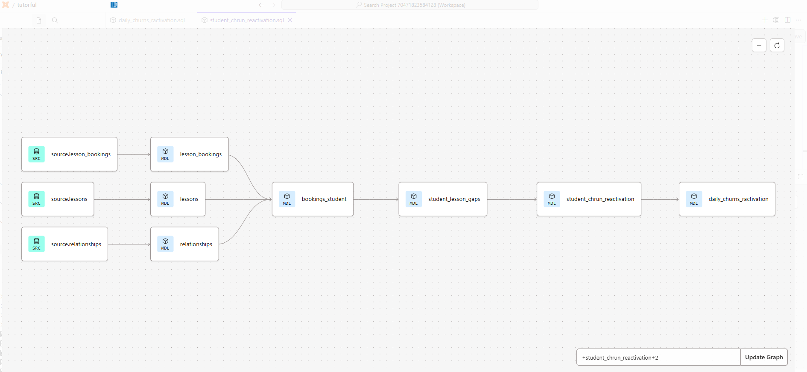
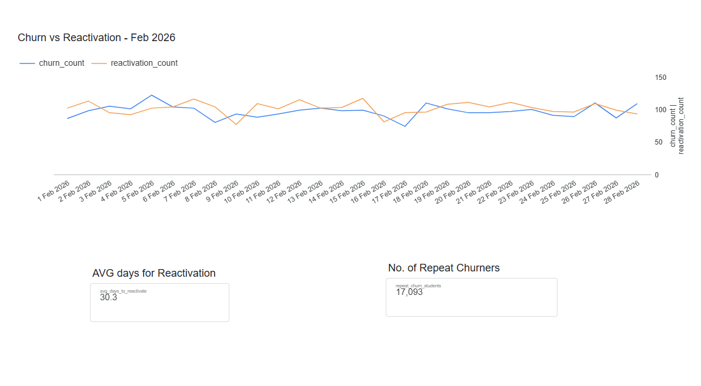

# Tutorful — Student Churn & Reactivation

Analytics engineering take-home submission.

**Business question:** For February 2026, what were the daily churn and reactivation volumes?

---

## Definitions

| Term | Definition |
|---|---|
| **Churn** | A student with no completed lesson for 30 consecutive days. Churn date = last completed lesson date + 30 days |
| **Reactivation** | A completed lesson by a student who had previously churned. A student can churn and reactivate multiple times across their lifetime |

---

## Project structure

```
tutorful/
├── models/
│   ├── sources/
│   │   └── sources.yml                     # Raw BigQuery tables declared as dbt sources
│   ├── staging/
│   │   ├── lesson_bookings.sql             # Clean raw bookings, parse timestamps
│   │   ├── lessons.sql                     # Clean raw lessons
│   │   ├── relationships.sql               # Clean raw relationships
│   │   ├── bookings_student.sql            # Join all three, completed lessons only
│   │   ├── dates.sql                       # dbt_date generated date spine
│   │   └── dim_date.sql                    # Enriched date dimension with fiscal periods
│   ├── silver/
│   │   └── student_lesson_gaps.sql         # LAG() gaps-and-islands churn detection
│   └── mart/
│       ├── student_churn_reactivation.sql  # Event-level: one row per churn cycle
│       └── daily_churns_reactivation.sql   # Date-grain: daily counts with date spine
├── tests/
│   ├── assert_reactivation_after_churn.sql
│   └── assert_no_duplicate_churn_events.sql
├── models/schema.yml                       # Column descriptions and tests
├── packages.yml                            # dbt_date and dbt_utils packages
├── dbt_project.yml
└── README.md
```

---

## Lineage



---

## Data sources

The four raw tables were loaded from the provided xlsx files into BigQuery's `source` dataset as a one-time manual step via the BigQuery console.

**Note:** dbt does not ingest data — it transforms data already resident in the warehouse. The manual load is intentional and appropriate here. In a production setup this would be handled by a dedicated ingestion tool such as Fivetran or Airbyte.

| Table | Description |
|---|---|
| `lesson_bookings` | One row per booking with timestamps and completion status |
| `lessons` | One row per lesson, links a booking to a tutor-student relationship |
| `relationships` | Maps tutor IDs to student IDs |
| `subjects` | Subject hierarchy using nested set model — excluded (see below) |

---

## Layer conventions

This project follows a four-layer Medallion-style architecture:

| Layer | Folder | Purpose |
|---|---|---|
| Source | `sources/` | Raw tables declared as dbt sources, untouched |
| Staging | `staging/` | One model per source table — rename, cast, clean. Plus joined `bookings_student` and date models |
| Silver | `silver/` | Business logic layer. Gap detection and churn event derivation |
| Mart | `mart/` | Reporting-ready tables consumed by BI tools or ad-hoc queries |

---

## Key modeling decisions

**Cancelled lessons are excluded**
A cancelled lesson is not attended activity and does not reset the 30-day churn clock. Only `status = 'completed'` bookings are carried through. This filter is applied in `bookings_student` so no downstream model can accidentally include cancelled rows.

**`finish_date` used as the lesson date**
Gap calculations use `finish_date` (derived from `finish_time`) rather than `start_date`. A lesson is counted as completed on the date it finished, which is the more defensible definition for a churn clock.

**Same-day deduplication**
A student can have multiple completed bookings on the same day. `student_lesson_gaps` deduplicates to one row per student per `finish_date` before applying `LAG()`. Without this, same-day bookings would generate false zero-day gaps and corrupt the churn logic.

**Churn logic is generic, not hardcoded to February**
The models calculate events across all available history. February 2026 is applied as a filter at query time. The same models answer the same question for any month with no code changes.

**`subjects` table is excluded**
The subjects table uses a nested set structure (`left`, `right`, `Roll Up To`) which requires additional modelling to traverse correctly. Subject-level analysis is not required by the business question. This is a deliberate scoping decision, noted here for transparency.

**`dim_date` uses the `dbt_date` package**
Rather than generating a date spine inline with `GENERATE_DATE_ARRAY`, a proper date dimension is built using the `dbt_date` package. This provides fiscal period attributes out of the box and is more reusable across the project.

**A student can appear multiple times**
The business definition explicitly states a student can churn and reactivate multiple times. `student_lesson_gaps` captures every gap > 30 days per student, producing one churn/reactivation pair per gap. `churn_event_number` ranks these chronologically per student.

---

## Answering the business question

```sql
-- Daily churn and reactivation volumes for February 2026
select
    event_date,
    churn_count,
    reactivation_count
from `inspiring-code-334417.mart.daily_churns_reactivation`
where event_date between '2026-02-01' and '2026-02-28'
order by event_date
```

## Sample output — February 2026



---

## Extended analysis

Two metrics are included in `student_churn_reactivation` beyond the core ask:

**Repeat churners** — students who have churned more than once:
```sql
select count(distinct student_id) as repeat_churn_students
from `inspiring-code-334417.mart.student_churn_reactivation`
where is_repeat_churner = true
```
This segment may indicate periodic disengagement rather than permanent attrition and is worth monitoring separately.

**Average recovery lag** — how long students stay dormant before returning:
```sql
select round(avg(days_until_reactivation), 1) as avg_days_to_reactivate
from `inspiring-code-334417.mart.student_churn_reactivation`
```
Useful for calibrating the timing of re-engagement campaigns.

---

## Tests

**Generic tests** (defined in `schema.yml`)
- `unique` and `not_null` on all primary keys across every model
- `accepted_values` on `lesson_status` — enforces only 'completed' / 'cancelled'
- `dbt_utils.expression_is_true: > 30` on `days_since_previous_lesson` — confirms the gap threshold is correctly applied

**Singular tests**
- `assert_reactivation_after_churn` — reactivation_date must always be strictly after churn_date
- `assert_no_duplicate_churn_events` — a student cannot churn twice on the same date

---

## Packages used

```yaml
# packages.yml
packages:
  - package: calogica/dbt_date
    version: [">=0.10.0", "<1.0.0"]
  - package: dbt-labs/dbt_utils
    version: [">=1.0.0", "<2.0.0"]
```

Run `dbt deps` to install.

---

## How to run this project

> The raw data is not included in this repo as the source files exceed GitHub's recommended size limits. The pipeline can be reproduced by loading the original xlsx files into a BigQuery dataset named `source`.

**Requirements**
- GCP project with the four raw tables loaded into a dataset named `source`
- dbt-bigquery: `pip install dbt-bigquery`
- A `~/.dbt/profiles.yml` pointing at your BigQuery project

**profiles.yml**
```yaml
tutorful:
  target: dev
  outputs:
    dev:
      type: bigquery
      method: oauth
      project: your-gcp-project-id
      dataset: dbt_dev
      threads: 4
      timeout_seconds: 300
```

**Commands**
```bash
dbt deps                              # install packages
dbt run                               # build all models
dbt test                              # run all tests
dbt docs generate && dbt docs serve   # view lineage graph locally
```

---

## If this were a production pipeline

Deliberately excluded from this submission to keep scope focused:

- **Incremental models** — `student_churn_reactivation` would use `incremental` materialisation with a `merge` strategy rather than full rebuilds
- **Slim CI via GitHub Actions** — `dbt build --select state:modified+` on every PR, diffing against the production manifest
- **Separate dev / prod targets** — environment-specific datasets promoted via PR merge
- **Scheduled refresh** — dbt Cloud job triggered daily after lesson data lands
